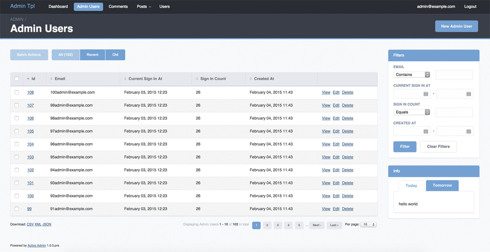

# ActiveAdminTheme

Custom ActiveAdmin templates


## Installation
As active_skin is the css theme for the [activeadmin](https://github.com/activeadmin/activeadmin) administration framework - you have to install if first.

Having active admin installed add the following line to your application's Gemfile:


```ruby
gem 'active_admin_theme'
```

And then execute:

    $ bundle

Or install it yourself as:

    $ gem install active_admin_theme

## Usage

```css
@import "wigu/active_admin_theme";
```
You can change basic colors of the theme by setting some variable above active_admin_theme import line in active_admin.css.scss

```css
...
$skinMainFirstColor: #A5A7AA!default;
$skinMainSecondColor: #0066CC!default;
$skinBorderWindowColor: #B8BABE!default;

@import "wigu/active_admin_theme";
...
```

## Screen

<a href="./img/wigu.png"></a>


## Contributing

1. Fork it ( https://github.com/activeadmin-plugins/active_admin_theme/fork )
2. Create your feature branch (`git checkout -b my-new-feature`)
3. Commit your changes (`git commit -am 'Add some feature'`)
4. Push to the branch (`git push origin my-new-feature`)
5. Create a new Pull Request
