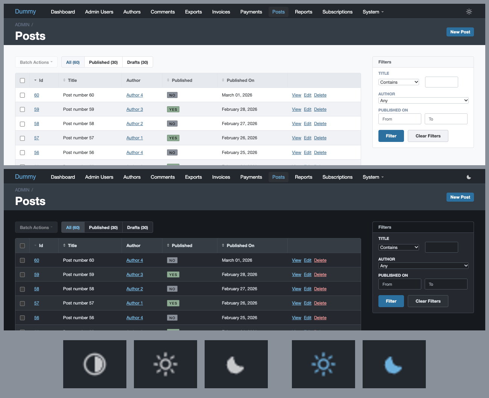
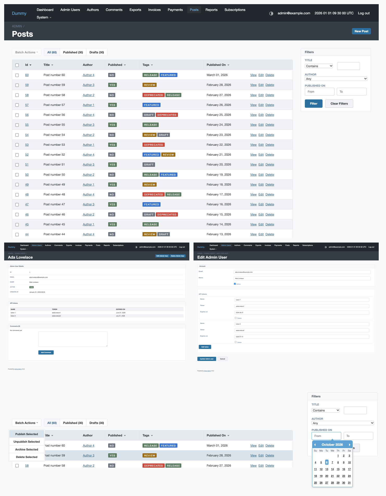
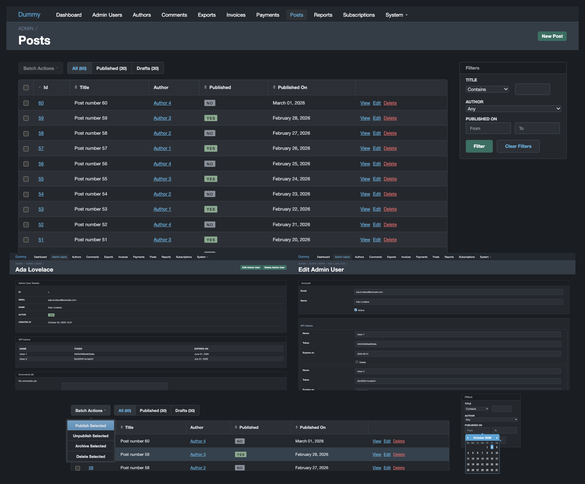
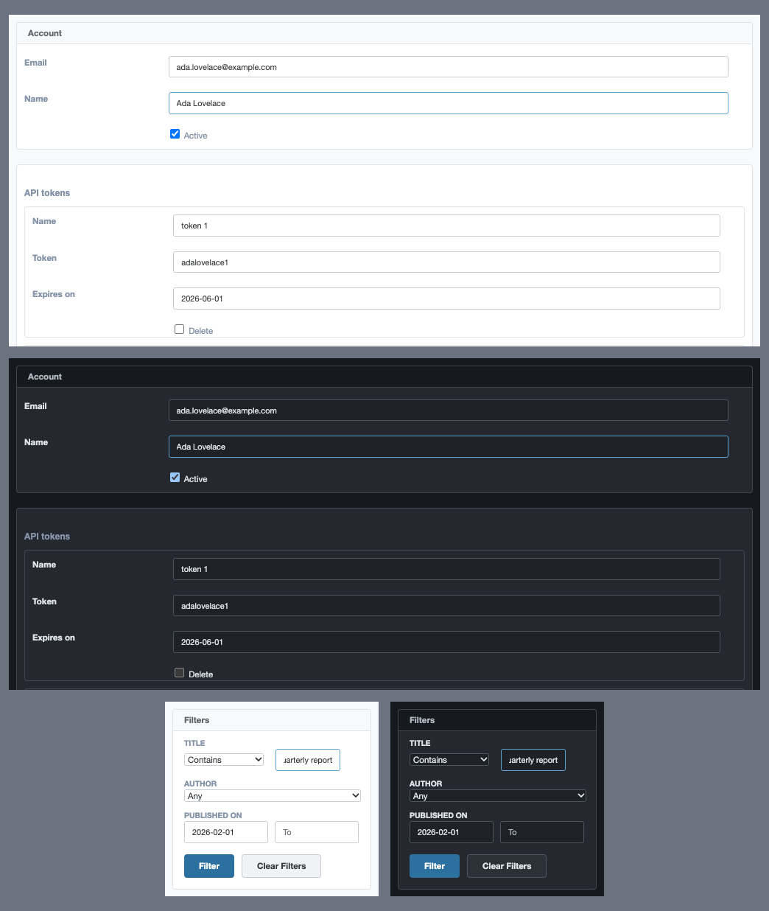

# ActiveAdminTheme

Custom ActiveAdmin templates


## Installation
As active_skin is the css theme for the [activeadmin](https://github.com/activeadmin/activeadmin) administration framework - you have to install if first.

#### As a Gem
Having active admin installed add the following line to your application's Gemfile:


```ruby
gem 'active_admin_theme'
```

And then execute:

    $ bundle

Or install it yourself as:

    $ gem install active_admin_theme

#### As a NPM module (Yarn package)
Execute:

    $ npm i @activeadmin-plugins/active_admin_theme

Or

    $ yarn add @activeadmin-plugins/active_admin_theme

Or add manually to `package.json`:

```
"dependencies": {
  "@activeadmin-plugins/active_admin_theme": "^3.1.1"
}
```
and execute:

    $ yarn

## Usage

In your base stylesheet entry point `active_admin.scss` (as example), add line:

#### As a Gem via Sprockets
```css
@import 'wigu/active_admin_theme';
```

#### As a NPM module (Yarn package) via Webpacker or any other assets bundler

```css
@import '@activeadmin-plugins/active_admin_theme';
```

## Customising

Set any of the variables below *above* the import line:

```scss
$skinMainFirstColor: #A5A7AA;
$skinMainSecondColor: #0066CC;
$skinBorderWindowColor: #B8BABE;

@import 'wigu/active_admin_theme';
```

Variables are typed. A value of the wrong kind — `none` where a colour is
expected, or a length without its unit — fails the build with a message
naming the variable, instead of silently emitting CSS the browser discards.

### Dark mode

The theme follows the operating system via `prefers-color-scheme`, and can be
pinned per page with `data-theme="light"` or `data-theme="dark"` on `<html>`.
Every colour below that has a `…Dark` twin is what dark mode uses; each twin
defaults to its light counterpart unless noted, so a project that only sets
the light value keeps one consistent colour in both modes.

### A worked example

The defaults are the configuration this theme is run with in
[yeti-web](https://github.com/yeti-switch/yeti-web). To go back to the blue
header the theme shipped before:

```scss
$skinMenuPillColor:          $skinMainSecondColor;
$skinMenuPanelColor:         $skinMainSecondColor;
$skinMenuTextColor:          #ffffff;
$skinMenuItemHoverColor:     transparent;
$skinMenuItemHoverTextColor: #ffffff;
$skinMenuFontSize:           1em;
$skinHeaderPaddingY:         7px;       // one value top and bottom
$skinTitleBarColor:          lighten($skinMainFirstColor, 8%);
$skinTitleBarBorderWidth:    3px;
$skinPanelHeaderColor:       $skinMainSecondColor;
$skinPanelHeaderTextColor:   #ffffff;
$skinTabInactiveColor:       $skinMainSecondColor;
$skinInactiveTabTextColor:   #ffffff;
$skinLinkColor:              $skinMainSecondColor;

@import 'wigu/active_admin_theme';
```

Note `var(--aa-page-bg)` works as a variable value: a custom property follows
the mode on its own, so one line covers both themes.

### Switching themes

The stylesheet follows the operating system on its own and honours
`data-theme="light"` or `data-theme="dark"` on `<html>`. A switch is optional
and ships with the gem:

```scss
// app/assets/javascripts/active_admin.js
//= require wigu/theme_toggle
```

```js
// or, as an npm module
import "@activeadmin-plugins/active_admin_theme/src/theme_toggle";
```

A gem cannot add a menu item: ActiveAdmin builds the utility navigation from
the host application's initializer, and nothing in a stylesheet or an asset
runs at that point. So with nothing else to do, the script injects its own
`li#theme_toggle` into `#utility_nav` on load. That works, but the item is
inserted before the server-rendered ones and is not yours to order or hide.

Declaring it yourself costs four lines and puts it under your control — this is
how [yeti-web](https://github.com/yeti-switch/yeti-web) does it:

```ruby
# config/initializers/active_admin.rb
config.namespace :admin do |admin|
  admin.build_menu :utility_navigation do |menu|
    # A real url, not "#": ActiveAdmin drops a blank utility item.
    menu.add id: "theme_toggle", label: "", url: "#theme",
             priority: 9_999_998, html_options: { role: "button" }
  end
end
```

The script finds `#theme_toggle` or anything carrying `.dark-mode-toggle`,
binds by delegation — so the control survives a re-render — and writes nothing
to the page but `data-mode`. Everything visible comes from the stylesheet.

[](./img/switch.png)

Below the two pages: the three states at rest — half circle for **auto**, sun
for **light**, moon for **dark** — then the last two hovered. A click moves to
the next state, so the control costs the width of one icon in a header that is
usually already full. The title says where that click goes, since one icon
cannot show both.

`auto` removes the attribute, so the media query decides and the page follows
the operating system live; the other two pin the choice in `localStorage` under
`aa-theme`. The third state is there so that following the system stays
reachable: a two-state toggle writes a preference on the first click and has no
way back short of clearing storage by hand.

The glyphs are inline SVG used as a CSS `mask`, so the gem still ships no image
files, there is nothing for a host application's CSP to allow, and the icon
takes `currentColor` — `$skinMenuTextColor` like the rest of the bar, and the
hover colour on hover. To use your own icon font instead, override
`$theme-icon-auto` / `$theme-icon-light` / `$theme-icon-dark`, or restyle
`#theme_toggle > a:before` outright.

The control is a link with no destination, so <kbd>Tab</kbd> reaches it and
<kbd>Enter</kbd> and <kbd>Space</kbd> operate it. Changing the theme in one tab
applies it in the others.

### Upgrading

#### 3.1.0

* Status tag fills are darker, so the label can be white and still clear 4.5:1 —
  it was black on mid-tone fills before. Each fill is a variable now
  (`$skinStatusTagOkColor` and the four beside it), and
  `$skinStatusTagTextColor: #000000;` restores the old label with the fills
  you choose.
* Index-table column headings take `$skinTextColor` rather than a muted grey,
  so a heading reads as strongly as the column under it.

#### 3.0.0

Three things changed shape and are worth knowing if you already set variables:

* Dropdown panels — the title-bar menu, the batch-actions menu and the
  table-tools menus — now follow the surface palette (`$skinSurfaceColor` and
  friends) instead of `$skinMainFirstColor` / `$skinMainSecondColor`. That is
  what lets them work in both modes. If you branded those panels through the
  two main colours, point `$skinSurfaceColor` and `$skinSurfaceHoverColor` at
  the same values.
* The primary button fill is darker (`darken($skinMainSecondColor, 20%)` rather
  than the accent itself). White on the accent is 2.74:1, under the 4.5:1 small
  text needs, and dark mode was already using this tone — the button is now one
  colour in both modes. Set `$skinButtonColor: $skinMainSecondColor;` for the
  old look.
* The default content link colour is darker (`#1f5f8d` rather than the accent).
  The accent is a fill colour and failed WCAG AA as body text. Set
  `$skinLinkColor` back to `$skinMainSecondColor` if you prefer the old look.

### Variables

#### Core

| Variable | Default (light / dark) | |
|---|---|---|
| `$skinMainFirstColor` | `#23282f` |  |
| `$skinMainSecondColor` | `#5ea3d3` |  |
| `$skinBorderRadius` | `4px` |  |
| `$skinBorderWindowColor` | `#e6e9ee` |  |
| `$skinTablePadding` | `10px` |  |

#### Surfaces, text and borders

| Variable | Default (light / dark) | |
|---|---|---|
| `$skinPageBgColor` / `$skinPageBgColorDark` | `#f7f9fb` / `#161a1e` | page background |
| `$skinSurfaceColor` / `$skinSurfaceColorDark` | `#ffffff` / `#25292f` | panels / cards / content |
| `$skinSurface2Color` / `$skinSurface2ColorDark` | `#f0f2f5` / `#2c3137` | table headers / striping / subtle fills |
| `$skinSurfaceHoverColor` / `$skinSurfaceHoverColorDark` | `#f5f7fa` / `#3f454d` | row / item hover |
| `$skinSelectedRowColor` / `$skinSelectedRowColorDark` | `#d9e4ec` / `#304457` | checked table row |
| `$skinElevatedColor` / `$skinElevatedColorDark` | `$skinSurfaceColor` / `#363c43` | tool buttons and dropdown panels floating above the page |
| `$skinTextColor` / `$skinTextColorDark` | `#323537` / `#dde2e8` | body text |
| `$skinTextMutedColor` / `$skinTextMutedColorDark` | `#6b7177` / `#b0b8c2` | secondary text / axis labels |
| `$skinBorderColor` / `$skinBorderColorDark` | `#e0e4e9` / `#404750` | borders / grid lines |
| `$skinInputBgColor` / `$skinInputBgColorDark` | `#ffffff` / `#1e2227` | form control background |
| `$skinInputBorderColor` / `$skinInputBorderColorDark` | `#c9ced4` / `#4d555f` | form control border |

#### Header menu

| Variable | Default (light / dark) | |
|---|---|---|
| `$skinMenuPillColor` | `#2e3236` | top-level current/hover pill |
| `$skinMenuPillTextColor` | `#6cb0de` | text on that pill; follows the dropdown text so a |
| `$skinMenuPanelColor` | `#2e3236` | dropdown panel bg + hover "bridge" border |
| `$skinMenuTextColor` | `#dfe2e6` | dropdown item text (was: inherited #fff) |
| `$skinMenuItemHoverColor` | `#3f454c` | dropdown item hover/current bg (was: none) |
| `$skinMenuItemHoverTextColor` | `#6cb0de` | hover/current dropdown item text, same reason |
| `$skinMenuFontSize` | `13px` | header menu text size |
| `$skinMenuItemPaddingY` | `5px` | dropdown item top/bottom padding (was 6px/4px + a 7px border) |
| `$skinMenuItemLineHeight` | `1.35` | dropdown item line-height |
| `$skinMenuPanelMaxWidth` | `260px` | dropdown panel ceiling; longer labels wrap instead of leaving the viewport |
| `$skinHeaderPaddingY` | `null` | sets both halves at once |
| `$skinHeaderPaddingTop` | `4.5px` | header top padding (base value, kept so the header does not shift) |
| `$skinHeaderPaddingBottom` | `4.5px` | header bottom padding |
| `$skinHeaderLogoMaxHeight` | `none` | cap the site_title logo image height |

#### Title bar

| Variable | Default (light / dark) | |
|---|---|---|
| `$skinTitleBarColor` | `#343c46` |  |
| `$skinTitleBarBorderColor` | `$skinMainSecondColor` |  |
| `$skinTitleBarBorderWidth` | `0` |  |
| `$skinTitleBarButtonPaddingY` | `6px` | action button vertical padding |
| `$skinTitleBarButtonPaddingX` | `10px` | action button horizontal padding |

#### Panels, tabs and labels

| Variable | Default (light / dark) | |
|---|---|---|
| `$skinPanelHeaderColor` / `$skinPanelHeaderColorDark` | `var(--aa-page-bg)` / `var(--aa-page-bg)` |  |
| `$skinPanelHeaderTextColor` / `$skinPanelHeaderTextColorDark` | `var(--aa-inactive-tab-text)` / `var(--aa-inactive-tab-text)` |  |
| `$skinPanelHeaderPaddingY` | `5px` | panel + sidebar header height |
| `$skinLabelColor` / `$skinLabelColorDark` | `#8494a8` / `$skinTextColorDark` |  |
| `$skinTabInactiveColor` / `$skinTabInactiveColorDark` | `#f7f9fb` / `#161a1e` | inactive tab fill |
| `$skinActiveTabTextColor` / `$skinActiveTabTextColorDark` | `$skinMainSecondColor` / `#7cc0ec` | selected tab label |
| `$skinInactiveTabTextColor` / `$skinInactiveTabTextColorDark` | `#5e6469` / `#b0b8c2` | inactive tab label |
| `$skinTableHeaderTextColor` / `$skinTableHeaderTextColorDark` | `$skinTextColor` / `$skinTextColorDark` | index-table column header text; the body text colour, so headings read as strongly as the rows |
| `$skinStatusTagTextColor` | `#ffffff` | label inside a filled status tag; `empty` / `unknown` / `none` have no fill and keep `$skinTextMutedColor` |
| `$skinStatusTagNeutralColor` | `#707681` | unclassified tags: `No`, protocol tags |
| `$skinStatusTagOkColor` | `#5e7e63` | `ok` `published` `complete` `completed` `green` `yes` |
| `$skinStatusTagNoticeColor` | `#3874d2` | `notice` `blue` |
| `$skinStatusTagWarnColor` | `#9e6c15` | `warn` `warning` `orange` |
| `$skinStatusTagErrorColor` | `#ce483b` | `error` `errored` `red` |
| `$skinTabPaddingY` | `8px` | tab height |
| `$skinTabPaddingX` | `15px` | tab label horizontal padding (text → border) |

#### Buttons and table tools

| Variable | Default (light / dark) | |
|---|---|---|
| `$skinButtonColor` / `$skinButtonColorDark` | `darken($skinMainSecondColor, 20%)` / `$skinButtonColor` | one tone in both modes; white on it is 5.35:1 |
| `$skinButtonTextColor` / `$skinButtonTextColorDark` | `#ffffff` / `$skinButtonTextColor` | label on those buttons |
| `$skinTableToolsHeight` | `30px` |  |
| `$skinTableToolsPaddingX` | `$skinTableToolsHeight * 0.4` | 12px at 30px |

#### Links

| Variable | Default (light / dark) | |
|---|---|---|
| `$skinAccentColor` / `$skinAccentColorDark` | `$skinMainSecondColor` / `$skinAccentColor` | focus ring / accent outline |
| `$skinLinkColor` / `$skinLinkColorDark` | `#38678b` / `#7cc0ec` |  |
| `$skinDeleteLinkColor` / `$skinDeleteLinkColorDark` | `$skinLinkColor` / `#f49b9b` |  |

## Screen

Index with filters, show page, nested `has_many` form, an open batch-actions
menu and the datepicker — the same admin in both modes. The theme follows the
operating system and can be pinned per page with `data-theme`.

#### Light

[](./img/light.png)

#### Dark

[](./img/dark.png)

#### Form and filter controls

Shown at full size, because the two shots above scale the controls down past
the point where you can tell what colour they are. Inputs, selects and
textareas take `$skinInputBgColor` / `$skinInputBorderColor` — white on
`#c9ced4` in light mode, a recessed `#1e2227` well on `#4d555f` in dark — and
the focused field (`Name`, `Title`) carries `$skinMainSecondColor`.

[](./img/inputs.png)

## Contributing

1. Fork it ( https://github.com/activeadmin-plugins/active_admin_theme/fork )
2. Create your feature branch (`git checkout -b my-new-feature`)
3. Commit your changes (`git commit -am 'Add some feature'`)
4. Push to the branch (`git push origin my-new-feature`)
5. Create a new Pull Request
