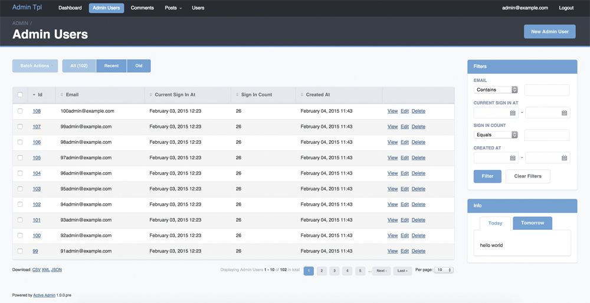

# ActiveAdminTheme

Custom ActiveAdmin templates


## Installation
As active_skin is the css theme for the [activeadmin](https://github.com/activeadmin/activeadmin) administration framework - you have to install if first.

#### As a Gem
Having active admin installed add the following line to your application's Gemfile:


```ruby
gem 'active_admin_theme'
```

And then execute:

    $ bundle

Or install it yourself as:

    $ gem install active_admin_theme

#### As a NPM module (Yarn package)
Execute:

    $ npm i @activeadmin-plugins/active_admin_theme

Or

    $ yarn add @activeadmin-plugins/active_admin_theme

Or add manually to `package.json`:

```
"dependencies": {
  "@activeadmin-plugins/active_admin_theme": "^2.0.0"
}
```
and execute:

    $ yarn

## Usage

In your base stylesheet entry point `active_admin.scss` (as example), add line:

#### As a Gem via Sprockets
```css
@import 'wigu/active_admin_theme';
```

#### As a NPM module (Yarn package) via Webpacker or any other assets bundler

```css
@import '@activeadmin-plugins/active_admin_theme';
```

## Customising

Set any of the variables below *above* the import line:

```scss
$skinMainFirstColor: #A5A7AA;
$skinMainSecondColor: #0066CC;
$skinBorderWindowColor: #B8BABE;

@import 'wigu/active_admin_theme';
```

Variables are typed. A value of the wrong kind — `none` where a colour is
expected, or a length without its unit — fails the build with a message
naming the variable, instead of silently emitting CSS the browser discards.

### Dark mode

The theme follows the operating system via `prefers-color-scheme`, and can be
pinned per page with `data-theme="light"` or `data-theme="dark"` on `<html>`.
Every colour below that has a `…Dark` twin is what dark mode uses; each twin
defaults to its light counterpart unless noted, so a project that only sets
the light value keeps one consistent colour in both modes.

### A worked example

[yeti-web](https://github.com/yeti-switch/yeti-web) runs this theme with an
anthracite header instead of the blue one, and tabs that recede to the page
background so the selected one reads as raised. Its full configuration is in
`app/assets/stylesheets/themes/variables.scss`; the shape of it:

```scss
// Anthracite header menu instead of the theme's blue
$skinMenuPillColor:          #2e3236;
$skinMenuPillTextColor:      #6cb0de;   // accent highlight
$skinMenuPanelColor:         #2e3236;
$skinMenuItemHoverColor:     #3f454c;
$skinMenuTextColor:          #dfe2e6;
$skinMenuItemHoverTextColor: #6cb0de;
$skinMenuFontSize:           13px;
$skinHeaderPaddingY:         4.5px;
$skinHeaderLogoMaxHeight:    27px;

// Title bar: dark, no accent border, smaller buttons
$skinTitleBarColor:          #343c46;
$skinTitleBarBorderWidth:    0;
$skinTitleBarButtonPaddingY: 6px;
$skinTitleBarButtonPaddingX: 10px;

// Panel headers recede to the page background, in both modes
$skinPanelHeaderColor:       var(--aa-page-bg);
$skinPanelHeaderColorDark:   var(--aa-page-bg);

// Inactive tabs recede too, so the active one reads as raised
$skinTabInactiveColor:       #f7f9fb;
$skinTabInactiveColorDark:   #1a1d21;
$skinActiveTabTextColor:     #5ea3d3;
$skinActiveTabTextColorDark: #6cb0de;

// A muted teal for buttons in dark mode
$skinButtonColorDark:        #3c6e62;

@import 'wigu/active_admin_theme';
```

Note `var(--aa-page-bg)` used as a variable value: a custom property follows
the mode on its own, so one line covers both themes.

### Upgrading

Two things changed shape in this release and are worth knowing if you already
set variables:

* Dropdown panels — the title-bar menu, the batch-actions menu and the
  table-tools menus — now follow the surface palette (`$skinSurfaceColor` and
  friends) instead of `$skinMainFirstColor` / `$skinMainSecondColor`. That is
  what lets them work in both modes. If you branded those panels through the
  two main colours, point `$skinSurfaceColor` and `$skinSurfaceHoverColor` at
  the same values.
* The default content link colour is darker (`#1f5f8d` rather than the accent).
  The accent is a fill colour and failed WCAG AA as body text. Set
  `$skinLinkColor` back to `$skinMainSecondColor` if you prefer the old look.

### Variables

#### Core

| Variable | Default (light / dark) | |
|---|---|---|
| `$skinMainFirstColor` | `#23282f` |  |
| `$skinMainSecondColor` | `#5ea3d3` |  |
| `$skinBorderRadius` | `4px` |  |
| `$skinBorderWindowColor` | `#e6e9ee` |  |
| `$skinTablePadding` | `10px` |  |

#### Surfaces, text and borders

| Variable | Default (light / dark) | |
|---|---|---|
| `$skinPageBgColor` / `$skinPageBgColorDark` | `#f7f9fb` / `#1a1d21` | page background |
| `$skinSurfaceColor` / `$skinSurfaceColorDark` | `#ffffff` / `#24272c` | panels / cards / content |
| `$skinSurface2Color` / `$skinSurface2ColorDark` | `#f0f2f5` / `#2c3036` | table headers / striping / subtle fills |
| `$skinSurfaceHoverColor` / `$skinSurfaceHoverColorDark` | `#f5f7fa` / `#30353b` | row / item hover |
| `$skinSelectedRowColor` / `$skinSelectedRowColorDark` | `#d9e4ec` / `#35414c` | checked table row |
| `$skinElevatedColor` / `$skinElevatedColorDark` | `$skinSurfaceColor` / `#30353b` | tool buttons and dropdown panels floating above the page |
| `$skinTextColor` / `$skinTextColorDark` | `#323537` / `#d7dbe0` | body text |
| `$skinTextMutedColor` / `$skinTextMutedColorDark` | `#6b7177` / `#9aa0a6` | secondary text / axis labels |
| `$skinBorderColor` / `$skinBorderColorDark` | `#e0e4e9` / `#3a3f45` | borders / grid lines |
| `$skinInputBgColor` / `$skinInputBgColorDark` | `#ffffff` / `#2c3036` | form control background |
| `$skinInputBorderColor` / `$skinInputBorderColorDark` | `#c9ced4` / `#454b52` | form control border |

#### Header menu

| Variable | Default (light / dark) | |
|---|---|---|
| `$skinMenuPillColor` | `$skinMainSecondColor` | top-level current/hover pill |
| `$skinMenuPillTextColor` | `$skinMenuTextColor` | text on that pill; follows the dropdown text so a |
| `$skinMenuPanelColor` | `$skinMainSecondColor` | dropdown panel bg + hover "bridge" border |
| `$skinMenuTextColor` | `#ffffff` | dropdown item text (was: inherited #fff) |
| `$skinMenuItemHoverColor` | `transparent` | dropdown item hover/current bg (was: none) |
| `$skinMenuItemHoverTextColor` | `$skinMenuTextColor` | hover/current dropdown item text, same reason |
| `$skinMenuFontSize` | `1em` | header menu text size |
| `$skinMenuItemPaddingY` | `8px` | dropdown item top/bottom padding (was 6px/4px + a 7px border) |
| `$skinMenuItemLineHeight` | `1.5` | dropdown item line-height |
| `$skinMenuPanelMaxWidth` | `260px` | dropdown panel ceiling; longer labels wrap instead of leaving the viewport |
| `$skinHeaderPaddingY` | `null` | sets both halves at once |
| `$skinHeaderPaddingTop` | `5px` | header top padding (base value, kept so the header does not shift) |
| `$skinHeaderPaddingBottom` | `9px` | header bottom padding |
| `$skinHeaderLogoMaxHeight` | `none` | cap the site_title logo image height |

#### Title bar

| Variable | Default (light / dark) | |
|---|---|---|
| `$skinTitleBarColor` | `lighten($skinMainFirstColor, 8%)` |  |
| `$skinTitleBarBorderColor` | `$skinMainSecondColor` |  |
| `$skinTitleBarBorderWidth` | `3px` |  |
| `$skinTitleBarButtonPaddingY` | `10px` | action button vertical padding |
| `$skinTitleBarButtonPaddingX` | `20px` | action button horizontal padding |

#### Panels, tabs and labels

| Variable | Default (light / dark) | |
|---|---|---|
| `$skinPanelHeaderColor` / `$skinPanelHeaderColorDark` | `$skinMainSecondColor` / `$skinPanelHeaderColor` |  |
| `$skinPanelHeaderTextColor` / `$skinPanelHeaderTextColorDark` | `#ffffff` / `$skinPanelHeaderTextColor` |  |
| `$skinPanelHeaderPaddingY` | `8px` | panel + sidebar header height |
| `$skinLabelColor` / `$skinLabelColorDark` | `#8494a8` / `$skinTextColorDark` |  |
| `$skinTabInactiveColor` / `$skinTabInactiveColorDark` | `$skinPanelHeaderColor` / `$skinPanelHeaderColorDark` | inactive tab fill |
| `$skinActiveTabTextColor` / `$skinActiveTabTextColorDark` | `$skinLinkColor` / `$skinLinkColorDark` | selected tab label |
| `$skinInactiveTabTextColor` / `$skinInactiveTabTextColorDark` | `$skinPanelHeaderTextColor` / `$skinInactiveTabTextColor` | inactive tab label |
| `$skinTableHeaderTextColor` / `$skinTableHeaderTextColorDark` | `#5e6469` / `#d7dbe0` | index-table column header text |
| `$skinTabPaddingY` | `10px` | tab height |
| `$skinTabPaddingX` | `20px` | tab label horizontal padding (text → border) |

#### Buttons and table tools

| Variable | Default (light / dark) | |
|---|---|---|
| `$skinButtonColor` / `$skinButtonColorDark` | `$skinMainSecondColor` / `$skinButtonColor` |  |
| `$skinButtonTextColor` / `$skinButtonTextColorDark` | `#ffffff` / `$skinButtonTextColor` | label on those buttons |
| `$skinTableToolsHeight` | `30px` |  |
| `$skinTableToolsPaddingX` | `$skinTableToolsHeight * 0.4` | 12px at 30px |

#### Links

| Variable | Default (light / dark) | |
|---|---|---|
| `$skinAccentColor` / `$skinAccentColorDark` | `$skinMainSecondColor` / `$skinAccentColor` | focus ring / accent outline |
| `$skinLinkColor` / `$skinLinkColorDark` | `#1f5f8d` / `#6cb0de` |  |
| `$skinDeleteLinkColor` / `$skinDeleteLinkColorDark` | `$skinLinkColor` / `#e06c6c` |  |

## Screen

<a href="./img/wigu.png"></a>


## Contributing

1. Fork it ( https://github.com/activeadmin-plugins/active_admin_theme/fork )
2. Create your feature branch (`git checkout -b my-new-feature`)
3. Commit your changes (`git commit -am 'Add some feature'`)
4. Push to the branch (`git push origin my-new-feature`)
5. Create a new Pull Request
