# PR #47 «Header menu colors» — что пофикшено

Ревью [PR #47](https://github.com/activeadmin-plugins/active_admin_theme/pull/47)
дало 15 находок в `app/assets/stylesheets/wigu/active_admin_theme.scss`.
Здесь по одной подпапке на дефект: `before.png` — состояние головы PR
(`yeti-switch:header_menu_colors`, `f62025f`), `after.png` — после правок из
`active_admin_theme.scss.patch`.

## Как снималось

Rails-приложения для этого не нужно. Тема компилируется вместе с настоящими
стилями ActiveAdmin 3.5.2 (`sassc` + load path на гем), результат подключается к
статической странице с разметкой хедера ActiveAdmin (`harness.tpl.html`), меню
открывается настоящим наведением курсора в Chromium. Иконки-стрелки в базе — это
`data:` URI, поэтому ассет-пайплайн не нужен.

```bash
ruby -rsassc -e '
  aa = Gem::Specification.find_by_name("activeadmin").gem_dir + "/app/assets/stylesheets"
  src = %(@import "active_admin/mixins";\n#{ARGV[1]}\n@import "active_admin/base";\n) +
        %(@import "wigu/active_admin_theme";\n)
  File.write(ARGV[0], SassC::Engine.new(src, load_paths: [aa, "app/assets/stylesheets"],
                                        style: :expanded).render)' out.css '$skinMenuPanelColor:#ffffff;'
```

Замеры (`getBoundingClientRect`, `scrollWidth`) — в iframe шириной ровно 1280px,
чтобы «за краем окна» означало то же, что у пользователя.

## Как проверить, что ничего не сломалось

```
$ rake css
css_check: 8 overrides compile clean, 6 bad ones rejected
```

`test/css_check.rb` компилирует тему в восьми конфигурациях override, проверяет,
что шесть заведомо битых значений отбиваются `@error`, и что в правилах
`#wrapper #header ul.tabs` не осталось захардкоженного белого. Гем отдаёт только
SCSS — без этой проверки его вообще никто не компилирует до релиза. На голой
голове PR 47 тот же скрипт даёт `4 problem(s)`.

Сам стенд со скриншотами поднимается так:

```
$ ruby docs/pr-47-fixes/preview.rb
http://localhost:8731/
```

Скрипт печатает таблицу «папка → URL → что навести». Версия «before» получается
обратным применением `active_admin_theme.scss.patch` к текущему файлу темы, так
что хранить вторую копию темы не нужно.

---

## 01-menu-text-color

| before (PR #47) | after |
|---|---|
| 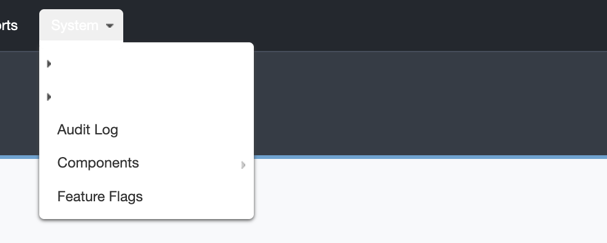 | 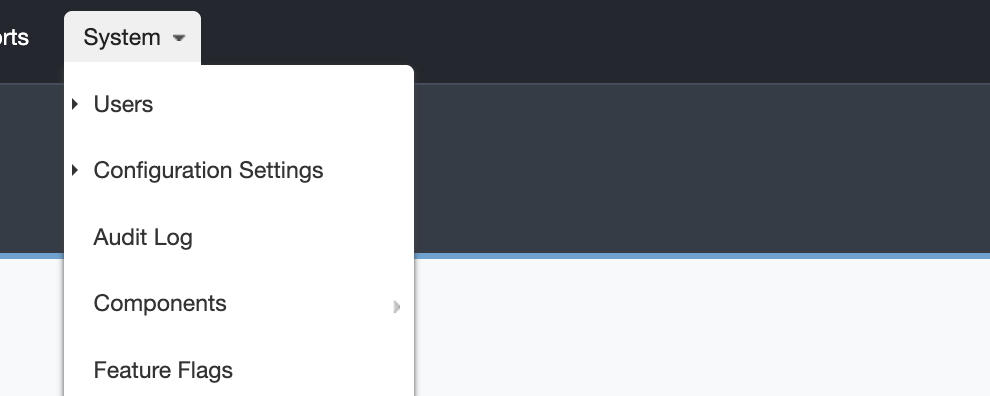 |

**Симптом.** Текст наведённого и текущего пункта дропдауна невидим на светлой панели.

**Причина.** В новом правиле состояния стоял литерал `color: #ffffff` со
специфичностью (2,3,5) — он перебивал `color: $skinMenuTextColor` (2,2,5) строкой
выше. Переменная, ради которой PR и существует, не работала. `li.current` —
состояние не временное, так что пункт текущей страницы был невидим постоянно.

**Фикс.** Литерал удалён — правило `li > a` с `$skinMenuTextColor` применяется само.
Плюс добавлена `$skinMenuPillTextColor` для текста на верхней «пилюле»: она красится
из `$skinMenuPillColor`, а текст на ней тоже был захардкожен белым.

```scss
li:hover > a, li.current > a, li > a:focus {
  background-color: $skinMenuItemHoverColor;
-  color: #ffffff;
}
```

**Конфиг снимка.** `$skinMenuPanelColor:#ffffff; $skinMenuTextColor:#333333; $skinMenuPillColor:#f0f0f0`
(в `after` дополнительно `$skinMenuPillTextColor:#222222`). Курсор на «Users»;
«Configuration Settings» помечен как `.current`. Контраст белого на `#ffffff` — 1.0:1.

## 02-dropdown-width

| before (PR #47) | after |
|---|---|
| 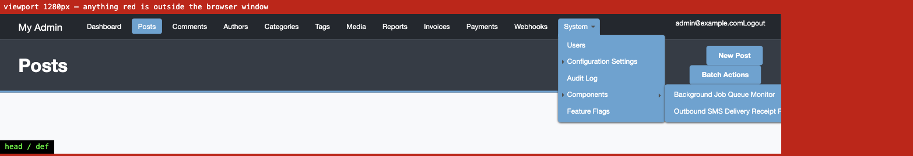 | 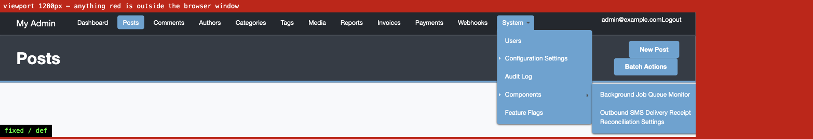 |

**Симптом.** Длинный пункт подменю уезжает за правый край окна. Доскроллить до него
нельзя: горизонтальный скролл разрывает цепочку `:hover`, и меню закрывается.

**Причина.** `width: auto; max-width: none` вместе с `white-space: nowrap` снимало
последнее ограничение ширины: при `nowrap` shrink-to-fit вырождается в полную ширину
строки. Это единственная правка PR, которая приезжает **всем** — она не спрятана ни
за какой переменной.

**Фикс.** Потолок ширины + перенос вместо распирания.

```scss
width: max-content;
max-width: $skinMenuPanelMaxWidth;   // 260px по умолчанию
overflow-wrap: break-word;
// white-space: nowrap убран
```

**Замеры** (viewport 1280px, «System» у правого края, длинный лейбл в подменю):

| | ширина flyout | за краем окна | `scrollWidth` |
|---|---|---|---|
| master | 195px (переносился) | −5.2px | 1280 |
| PR #47 | 323px | **+132.5px** | 1420 |
| после фикса | 260px (упёрся в потолок) | +69.5px | 1357 |

**Остаточный потолок — честно.** Flyout второго уровня стоит на `left: 100%` уже
смещённой панели, а CSS не видит расстояния до края вьюпорта. У самого ActiveAdmin
там всего 5px запаса, поэтому любое расширение панели это наследует. На снимке
`after` текст читается полностью (переносится в две строки), но фон панели всё ещё
заходит за край. В коде помечено комментарием `ponytail:` с апгрейдом: JS, который
флипает flyout на `right: 100%`, либо CSS anchor positioning, когда он станет baseline.

## 03-dropdown-row-height

| before (PR #47) | after |
|---|---|
| 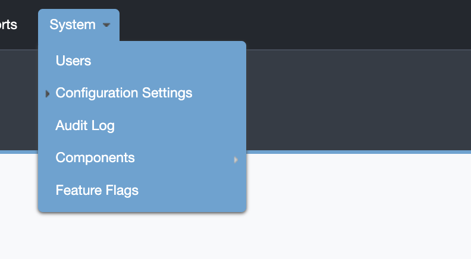 | 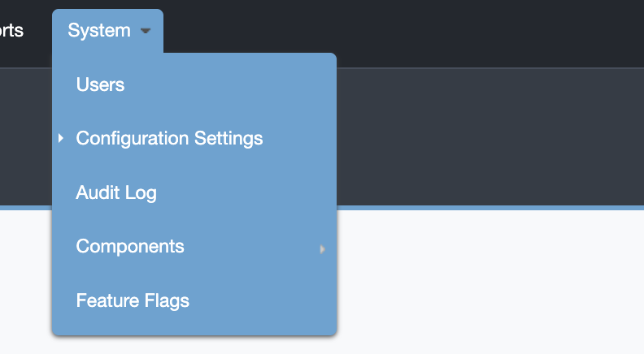 |

**Симптом.** Строки дропдауна стали заметно теснее, чем были до PR.

**Причина.** PR сузил `ul.tabs li.has_nested:hover a` до `> a`, чтобы «бридж»-бордер
не доставался вложенным пунктам. Но старый селектор был потомковым, и пока верхний
пункт наведён, **каждый** якорь открытой панели получал `border-bottom: 7px` цветом
панели — то есть 7px межстрочного просвета. Новый `> a` убрал его у всех. Комментарий
в PR описывал только мотивацию с вложенными пунктами, так что ревьюер не мог понять,
намеренно это или нет.

**Фикс.** `$skinMenuItemPaddingY` с 5px до 8px — просвет восстановлен нормальным
паддингом, а не побочным эффектом бордера.

| | высота строки |
|---|---|
| master | 34.3px (6+4 паддинг + 7px бордер) |
| PR #47 | 27.3px |
| после фикса | 33.3px |

**Конфиг снимка.** Дефолтный, курсор на «System».

## 04-pill-panel-seam

| before (PR #47) | after |
|---|---|
| 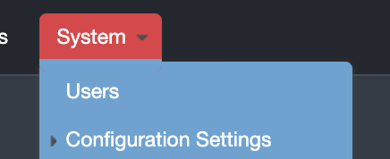 | 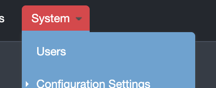 |

**Симптом.** На стыке «пилюли» и панели дропдауна — просвет цвета хедера `#23282f`
в скруглённых углах, а под пилюлей лежит полоса чужого цвета.

**Причина.** Две независимые.
1. Бридж-бордер красится из `$skinMenuPanelColor`, а пилюля — из `$skinMenuPillColor`.
   Пока обе переменные равны, это не видно; как только их разводят — ради чего PR и
   делался — под красной пилюлей появляется синяя полоса. Плюс 7px не совпадали с
   базовым зазором `ul { margin-top: 5px }`.
2. Тема накрывает обе половины стыка своим `@include rounded($skinBorderRadius)`.
   ActiveAdmin специально квадратит их (`rounded-top` у наведённой пилюли зануляет
   нижние углы, `rounded-all(0,10px,10px,10px)` у панели — верхний левый), но
   селектор темы `#wrapper #header ul.tabs > li > a` (2,1,3) бьёт базовый
   `#header ul.tabs > li.has_nested:hover > a` (1,3,3) по количеству ID.

**Фикс.**

```scss
ul { @include rounded-all(0, $skinBorderRadius, $skinBorderRadius, $skinBorderRadius); }

> li.has_nested:hover > a {
  @include rounded-top($skinBorderRadius);
  border-bottom: 5px solid $skinMenuPanelColor;   // было 7px
}
```

**Конфиг снимка.** `$skinMenuPillColor:#e63946` при синей панели по умолчанию —
ровно тот сценарий, ради которого переменные и разделили.

## 05-header-vertical-shift

| before (PR #47) | after |
|---|---|
| 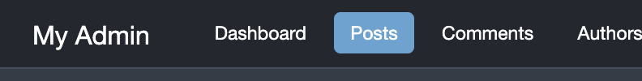 | 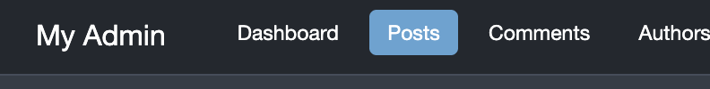 |

**Симптом.** Всё содержимое хедера съехало на 2px вниз. Прилетает всем, кто не
трогал ни одной переменной.

**Причина.** До PR тема ставила только `padding-bottom: 9px`, верхний оставался
базовым 5px. PR свёл обе в одну `$skinHeaderPaddingY: 7px`. Сумма та же (высота
хедера 42.3px в обоих случаях), а содержимое поехало. При этом комментарий в шапке
файла утверждал, что «projects that do not set these compile to identical CSS».

**Фикс.** Две переменные вместо одной, дефолты сохраняют старый рендер.

```scss
$skinHeaderPaddingTop: 5px!default;
$skinHeaderPaddingBottom: 9px!default;
```

| | верх текста в хедере |
|---|---|
| master | 5.5px |
| PR #47 | 7.5px |
| после фикса | 5.5px |

Сам комментарий в шапке тоже переписан: утверждение про «identical CSS» было ложным
(семь реальных отличий в скомпилированном CSS при пустой конфигурации), и именно оно
провоцировало принять PR за no-op рефактор.

## 06-submenu-marker-color

| before (PR #47) | after |
|---|---|
| 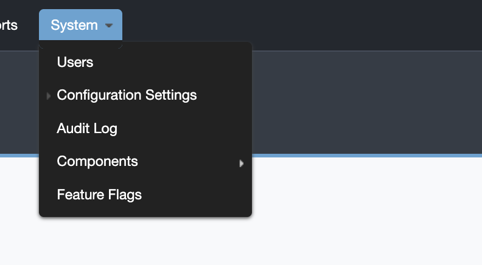 | 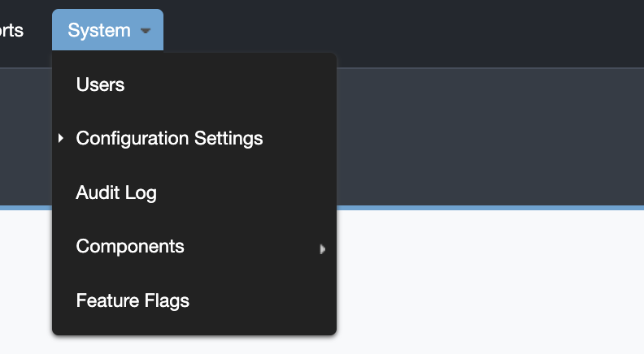 |

**Симптом.** На тёмной панели маркер текущего/наведённого пункта почти не виден.

**Причина.** Маркер был жёстко прибит к PNG `$menu-arrow-dark-icon-url` (чернила
`#424242`–`#6d6d6d`). На дефолтной панели `#5ea3d3` это 3.28:1, на `#222222` — 1.77:1.
А так как `$skinMenuItemHoverColor` по умолчанию `transparent`, тёмная панель убирает
и фон наведения, и маркер — обратной связи не остаётся вообще. Симметрично: базовая
стрелка «есть подменю» — светлая, на белой панели это 2.32:1. PR добавил переменную
цвета панели, но не добавил ничего для иконок.

**Фикс.** PNG заменён на CSS-треугольник на `currentColor` — он автоматически следует
за `$skinMenuTextColor`, никакой новой переменной и никакого ассета.

```scss
border: 3px solid transparent;
border-left-color: currentColor;
```

**Конфиг снимка.** `$skinMenuPanelColor:#222222`.

## 07-marker-vertical-centering

| before (PR #47) | after |
|---|---|
| 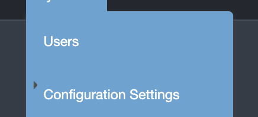 |  |

**Симптом.** При увеличенном паддинге пунктов маркер висит над текстом.

**Причина.** `top: 12px` — магическое число. На дефолтах строка 27.3px, её центр
13.6px против оптического центра маркера 14px: совпало случайно, потому и незаметно.
PR сделал `$skinMenuItemPaddingY` настраиваемым, но маркер за ним не следует.

**Фикс.**

```scss
top: 50%;
margin-top: -3px;
```

**Конфиг снимка.** `$skinMenuItemPaddingY: 14px`. При 12px расхождение 6.6px.

## 08-menu-font-size-leak

| before (PR #47) | after |
|---|---|
| 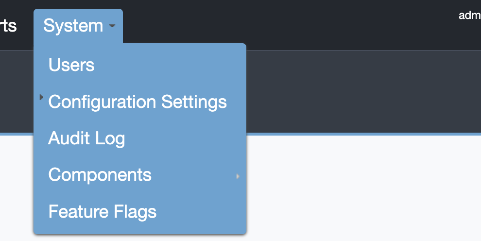 | 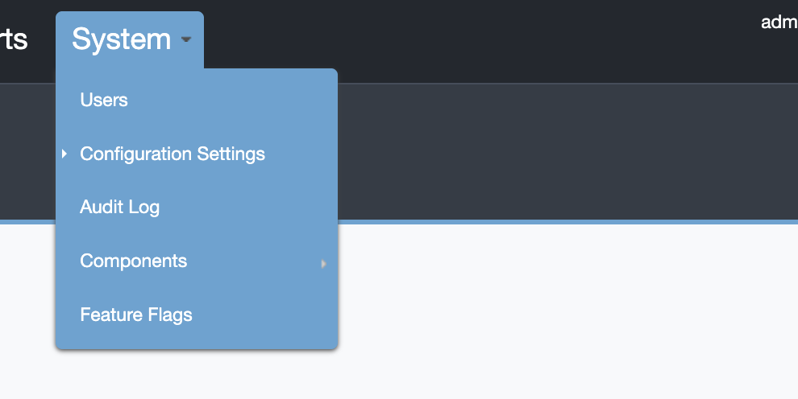 |

**Симптом.** `$skinMenuFontSize` увеличивает не только верхнее меню, но и весь
дропдаун вместе с ним.

**Причина.** Размер в `em` вешался на `ul.tabs > li`, а дропдаун — потомок этого же
`li`, сброса размера внутри нет. Комментарий обещал «header menu text size». Заодно
безразмерный `$skinMenuItemLineHeight` пересчитывается от увеличенного кегля, так
что строки дропдауна ещё и выше становятся, а паддинг пилюли и `top` маркера — нет.

**Фикс.** Перенести на сам якорь верхнего уровня: пункты дропдауна — это
`ul.tabs > li > ul > li > a`, под `> a` они не подпадают.

```scss
-    ul.tabs > li { font-size: $skinMenuFontSize; }
+    ul.tabs > li > a { font-size: $skinMenuFontSize; }
```

**Конфиг снимка.** `$skinMenuFontSize: 1.6em`.

## 09-titlebar-button-padding

| before (PR #47) | after |
|---|---|
| 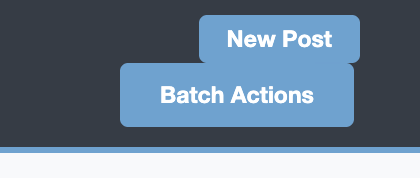 | 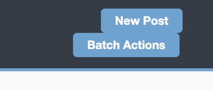 |

**Симптом.** `$skinTitleBarButtonPaddingY/X` меняют только одну кнопку тулбара,
соседняя остаётся прежней.

**Причина.** В файле восемь одинаковых правил `padding: 10px 20px`; PR вынес в
переменные ровно одно. `div.batch_actions_selector` живёт в том же `#titlebar_right`,
что и `.action_item`, и остался на литерале.

**Фикс.** Те же переменные применены и к `batch_actions_selector` в `#title_bar`.
Остальные шесть литералов не тронуты сознательно: это вкладки, скоупы и сабмиты
форм — другие компоненты, имя переменной к ним не относится.

**Конфиг снимка.** `$skinTitleBarButtonPaddingY:6px; $skinTitleBarButtonPaddingX:14px`.

## 10-keyboard-focus

| before (PR #47) | after |
|---|---|
| 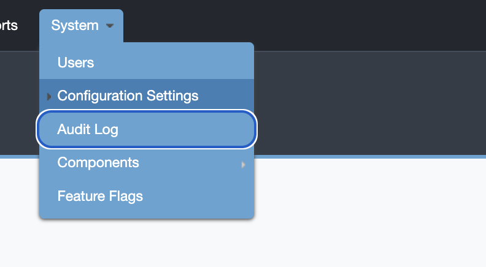 | 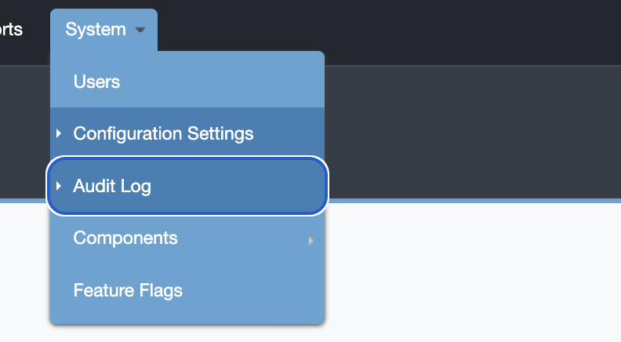 |

**Симптом.** У пункта дропдауна, на котором стоит фокус клавиатуры, нет собственной
индикации темы — только нативный outline браузера.

**Причина.** Новое правило состояния описывает `:hover` и `.current`, но не `:focus`.
Во всём файле `:focus` встречается только у полей форм. Поскольку
`$skinMenuItemHoverColor` по умолчанию `transparent`, в проекте, который подавляет
нативный outline, сфокусированный пункт не отличается от соседних ничем.

**Фикс.** `:focus` добавлен и в правило фона, и в правило маркера.

```scss
li:hover > a, li.current > a, li > a:focus { ... }
li.current > a::before, li:hover > a::before, li > a:focus::before { ... }
```

**Конфиг снимка.** `$skinMenuItemHoverColor:#3a7fb5`, фокус выставлен программно на
«Audit Log».

---

## Не вошло в папки

- **Валидация переменных.** `$skinTitleBarBorderWidth: none`, `$skinMenuItemHoverColor: none`
  и `$skinMenuItemPaddingY: 8` (без `px`) — легальный SassScript, компилируются молча
  и дают `border-bottom: none solid #5ea3d3` / `padding-top: 8`, которые браузер
  выбрасывает без единого следа. В тему добавлены два `@each` с `@error`, которые
  роняют сборку с внятным сообщением. Скриншота нет — теперь это ошибка компиляции.
- **`lighten()` в `!default`.** `$skinTitleBarColor: lighten($skinMainFirstColor, 8%)`
  падает, если консьюмер задаёт `$skinMainFirstColor: var(--brand-dark)`. Не тронуто:
  `sassc` — это libsass, он не понимает `@use "sass:color"`, а `lighten()` там
  единственный доступный вариант. Строка `:83` имела ту же экспозицию и до PR.
- **`$skinHeaderLogoMaxHeight`.** Дефолт `none` — no-op (база не ставит `max-height`
  на `#header h1 img` вообще), а реальное значение раздувает строку хедера, потому что
  `#header` — это `display: table`, и пилюли центрируются в выросшей ячейке. Оставлено
  как есть: это осознанный выбор консьюмера.
- **README гема.** 13 новых публичных переменных задокументированы только комментариями
  в SCSS. Не дефект, но строчка в README не помешает.
